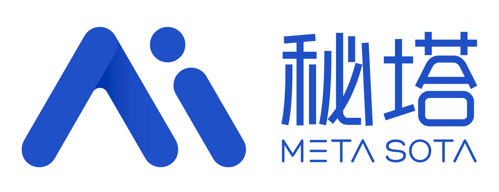

<div align="center">

## 🤝 赞助支持 · 秘塔科技

[](https://metaso.cn/minimax-h3/?s=AICON)

**MiniMax H3 视频生成 API｜秘塔科技**

秘塔科技提供高性价比的 MiniMax H3 视频生成服务：**768P 仅 0.09 元/秒，2K 仅 0.15 元/秒**。支持原生 2K、音画同步，API 兼容 **OpenAI 协议**，同时支持 **ComfyUI**，无需自行部署 GPU。

🎁 通过 [AICON 专属链接注册](https://metaso.cn/minimax-h3/?s=AICON)，即可领取赠送额度及专属优惠。

</div>

---
# AICON

[](LICENSE)
[](https://www.python.org/)
[](https://vuejs.org/)
[](https://fastapi.tiangolo.com/)
[](https://www.docker.com/)

AICON 是一套面向 AI 内容创作的全栈工作台，覆盖从文本理解、提示词组织、图片与视频生成，到素材管理和内容分发的完整流程，适用于 AI 电影、图文说、剧情短视频和可视化创作工作流等场景。

**自然语言驱动的开源无限画布 AI 工作流与 Agent 协作工作台**，让剧本、角色、分镜、关键帧与视频节点在同一画布协作。

在线站点：[https://aicon-studio.com/](https://aicon-studio.com/)

技术栈：`FastAPI`、`Vue 3`、`PostgreSQL`、`Redis`、`Celery`、`MinIO`

## 更新告知

**2026-09-10 · 中转站迁移与模型供应统一**

中转站现已更换为 [https://api.aicon-studio.com/](https://api.aicon-studio.com/)，模型调用接口保持不变。OpenAI 兼容连接请使用 `https://api.aicon-studio.com/v1`，其他协议路径见 [API 接口文档](https://dcsynw64g3.apifox.cn/)。已有用户请在“API 密钥管理”中更新 Base URL。

本次代码更新统一了模型供应入口：从站点动态获取模型目录，结合密钥权限展示精选模型；默认提供文本 10、图片 8、视频 5、配音 5 个，每类最多 15 个，其余隐藏。同协议新模型可通过配置启用，无需修改业务代码；有可靠发布日期的模型按最新排序。

升级时需应用数据库迁移 `030`，并同步更新 API、Worker 和 Beat。具体步骤与验证范围见[模型供应接入指南](docs/model-provider-configuration.md)和[自审记录](docs/model-provider-review.md)。

## 目录

- [更新告知](#更新告知)
- [项目概览](#项目概览)
- [核心功能](#核心功能)
- [适用场景](#适用场景)
- [功能截图](#功能截图)
- [Star 趋势](#star-趋势)
- [演示](#演示)
- [快速开始](#快速开始)
- [使用说明](#使用说明)
- [更新日志](#更新日志)
- [交流与支持](#交流与支持)
- [仓库结构](#仓库结构)
- [相关文档](#相关文档)
- [License](#license)

## 项目概览

AICON 当前主要包含以下能力：

- `Movie Studio`：将长文本拆解为角色、场景、分镜、关键帧和过渡视频，形成完整的 AI 电影制作链路。
- `Picture Narration`：面向图文说和短视频配图场景，支持章节拆分、提示词生成、配图生成、语音合成与渲染。
- `Canvas`：将文本、图片、视频节点放在同一画布中编辑，通过节点引用、连线和 Agent 助手组织生成上下文。
- `Distribution`：支持 Bilibili 等平台的自动化发布与内容分发。

项目特征：

- 统一工作流：从文本到图片、视频、配音、发布尽量在一套系统内完成。
- 可扩展供应商：支持自定义兼容 Base URL，可替换模型供应商。
- 异步任务架构：适合长链路生成任务、批量任务与媒体处理任务。
- 画布式创作：适合组织复杂 prompt、参考图和多轮生成结果。
- Agent 协作工作流：支持在画布侧边助手中按视频工作流创建节点链路，并由用户手动触发生成。

## 核心功能

### Movie Studio

面向长文本到视频的自动化生产流程：

- 智能解析文本，提取角色、场景与分镜结构。
- 基于角色参考图维持角色一致性，降低跨镜头“换脸”问题。
- 支持关键帧、过渡视频、背景音乐与音效合成。
- 输出适合主流视频平台发布的完整内容资产。

### Picture Narration

面向短视频配图和图文说的批量生成能力：

- 自动识别章节与段落结构。
- 为段落生成匹配的视觉提示词与构图描述。
- 并发生成图片、语音与字幕素材。
- 组合为可直接发布的视频内容。

### Canvas

面向创意编排和工作流组织的可视化画布：

- 支持文本、图片、视频节点自由排布与编辑。
- 支持通过连线建立依赖关系，并在生成时引用上游内容。
- 支持引用图片、上传参考图和叠加风格参考。
- 支持查看生成历史并回切历史版本。
- 打开画布时返回轻量快照，兼顾大画布加载和编辑体验。
- 内置 `Canvas Assistant`，可根据一句创意或剧本想法引导用户从剧本、角色三视图、分镜、关键帧到视频节点逐步搭建工作流。
- 工作流助手当前默认**只创建节点与连线**，不会自动提交角色三视图、关键帧、视频生成任务，后续生成由用户在画布中手动触发。
- 关键帧预备节点会自动带入对应角色三视图引用，便于后续保持角色一致性。
- 支持框选多个节点并一次性批量删除，删除前带确认环节；批量删除会同时清理关联连线。
- 图片节点和视频节点在新建时会自动填入默认 API Key 与默认模型，减少首次配置成本。

### Distribution

面向发布环节的自动化能力：

- 支持接入 Bilibili API。
- 支持上传视频、生成标题摘要与标签建议。

## 适用场景

- 小说、剧本、设定集等长文本的影视化生成
- AI 图文说、解说视频、剧情短视频的批量制作
- 角色一致性要求较高的图像与视频生成
- 提示词编排、参考图管理、多版本对比的创作流程

## 功能截图

### 无限画布Agent


### 角色管理


### 场景图生成


### 关键帧生成


### 过渡视频


### 发布管理


## Star 趋势

[](https://www.star-history.com/#869413421/aicon&Date)

## 演示

示例视频：

- [《静默战争》演示](https://www.bilibili.com/video/BV1DpvaB8EDE/?vd_source=2da8614f110387a6fe068f446424c748)
- [《艾尔登法环真人版预告》演示](https://www.bilibili.com/video/BV1w3igBpEXo)

## 快速开始

推荐使用 Docker 部署。

```bash
git clone https://github.com/869413421/aicon.git
cd aicon

cp .env.production.example .env.production
# 编辑 .env.production，填写数据库、Redis、JWT、MinIO 等配置

docker-compose -f docker-compose.prod.yml up -d
```

默认访问地址：

- 前端：`http://localhost`
- 后端 API：`http://localhost:8000`

更多部署细节见 [docs/docker-deployment-guide.md](docs/docker-deployment-guide.md)。

如需分别查看前后端说明，可进一步阅读：

- [backend/README.md](backend/README.md)
- [frontend/README.md](frontend/README.md)

## 使用说明

### 1. 获取 API Key

系统支持多种模型供应商；项目作者提供的兼容中转站现已迁移至：

- 注册地址：[https://api.aicon-studio.com/](https://api.aicon-studio.com/)
- 调用文档：[API 接口文档](https://dcsynw64g3.apifox.cn/)
- 模型广场数据：[模型与价格接口](https://api.aicon-studio.com/api/pricing)
- 注册并购买额度后，在令牌页面创建 API Key
- 建议按需购买

### 2. 配置系统 API Key

进入系统后台，在“API 密钥管理”页面新增密钥：

- 供应商：选择 `自定义`
- API 密钥：填写你自己的令牌
- Base URL：填写 `https://api.aicon-studio.com/v1`

注意：

- Base URL 结尾不要带斜杠，例如不要写成 `https://api.aicon-studio.com/v1/`
- 已有密钥请在编辑页面将旧站点的 Base URL 改为上述新地址；调用接口保持不变。
- 新建自定义连接默认使用新站点。运行时会把旧 AICON 域名归一化为新域名；其他自定义地址保持原样。已有未完成视频使用提交时的协议快照，变更连接后需恢复原连接才能继续查询。

### 3. 关于中转站

`https://api.aicon-studio.com/` 是项目作者自部署的大模型兼容中转站，目标是提供长期可用、相对低价的接入方式，并非强制绑定。OpenAI 兼容调用的 Base URL 为 `https://api.aicon-studio.com/v1`，其他协议路径请参考接口文档。

如果你已有自己的兼容网关、代理层或模型供应商，可以配置 Base URL，并在精选配置的 `sources` 中声明该连接适用的模型和协议。现有密钥与作品保留；未配置用途与协议的型号保持隐藏。

模型列表由后端动态获取，并取 **站点目录 ∩ 密钥 `/v1/models` 权限 ∩ 已启用精选配置**。内置精选为文本 10、图片 8、视频 5、配音 5 个；每类上限 15 个，其余隐藏。不同模型按配置使用 Chat、Responses、图片生成/编辑、Gemini、视频异步任务、TTS 等协议，响应转换为业务统一结果。

同协议的新模型只需修改 [models.json](backend/src/services/provider/models.json)，不需要改业务代码或重新构建。配置在下次请求时重读；新增远端型号默认隐藏，不能仅凭名称猜用途。已核实的 `released_at` 按最新日期排序，未核实日期的型号按配置顺序排在后面；站点 `updated_time` 不当作发布日期。

配置、接口、迁移和验证说明见[模型供应接入指南](docs/model-provider-configuration.md)，调查依据见[协议审计](docs/model-provider-protocol-audit.md)。上线前需应用数据库迁移 `030` 并更新 API / Worker / Beat。

相关代码位置：

- 后端供应商工厂：`backend/src/services/provider/factory.py`
- 后端统一协议适配：`backend/src/services/provider/gateway.py`
- 动态模型目录：`backend/src/services/provider/catalog.py`
- 精选模型与协议配置：`backend/src/services/provider/models.json`
- 前端 API 密钥管理页：`frontend/src/views/APIKeys.vue`
- 前端设置页 API 密钥面板：`frontend/src/views/settings/APIKeysSettings.vue`

### 4. 开始创作

基本流程如下：

1. 新建项目
2. 导入文本，建议按章节导入
3. 进入项目详情页，使用 `Movie Studio` 或 `Canvas`
4. 按角色提取、场景提取、分镜生成、素材生成和视频合成的顺序推进

## 更新日志

### 2026-09-10

- 中转站入口更新为 [https://api.aicon-studio.com/](https://api.aicon-studio.com/)，同步更新连接配置与接口文档链接。
- 合并分散的模型供应商实现，统一处理文本、图片、视频和配音的不同请求协议与响应格式。
- 模型选择改为站点目录、密钥权限与精选配置的交集；每类最多展示 15 个，未启用型号保持隐藏。
- 支持配置热更新，以及按已核实的发布日期降序展示；未核实日期的型号按配置顺序排在后面。
- 图片比例、参考图限制和配音音色随模型能力配置加载。
- 保存视频任务的提交协议与连接信息，支持后台持续查询；升级需执行数据库迁移 `030`。

### 2026-04-03

- 新增 `Canvas` 无限画布工作台
- 支持节点引用生成
- 支持生成历史回看与切换
- JWT TOKEN 默认有效期调整为 `7` 天，即 `10080` 分钟
- 调整 `custom` 供应商默认 Base URL；中转站现已迁移，当前地址见[更新告知](#更新告知)。

### 2026-04-06

- 新增 `Canvas Assistant` 画布侧边助手引导文案与流式状态优化
- 新增工作流辅助建链：可按剧本自动创建角色三视图、分镜、关键帧、视频节点及连线
- 工作流模式调整为“只创建节点，不自动提交生成任务”，后续生成由用户手动触发
- 关键帧预备节点自动注入角色三视图引用
- 画布支持 `Shift + 拖拽` 框选多节点，并支持批量删除确认
- 新建图片/视频节点时自动带默认 API Key 与默认模型

### 2026-02-28

- 新增 `gemini-3.1-flash-image-preview` 图像模型支持
- 新增 `gemini-3.1-pro` 文本模型支持

### 2026-01-23

- 发布 Docker 镜像 `v1.1.0`
- 修复模型列表加载问题
- `custom` 供应商新增一系列 Veo 3.1 视频模型支持

### 2026-01-15

- 在线站点上线内测
- 新增角色参考图能力
- 新增 `VEO3.1 4K` 模型支持
- 补充项目文档与交流群说明

## 交流与支持

扫码加入 AICON 内测交流群，获取最新动态、功能更新与使用支持。


## 仓库结构

```text
aicon/
├── backend/     # FastAPI 后端、任务队列、数据模型
├── frontend/    # Vue 3 前端
├── docs/        # 部署与开发文档
└── README.md
```

## 相关文档

- [backend/README.md](backend/README.md)
- [frontend/README.md](frontend/README.md)
- [docs/docker-deployment-guide.md](docs/docker-deployment-guide.md)

## License

本项目采用 [Apache License 2.0](LICENSE)。
